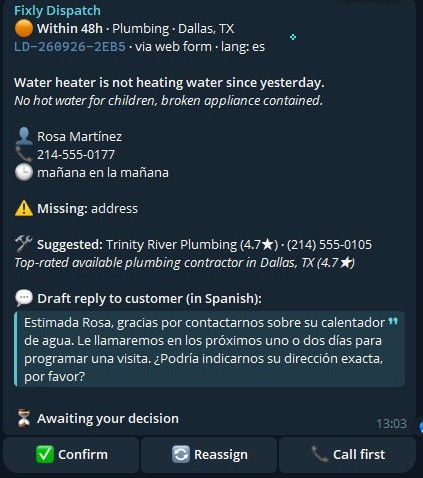
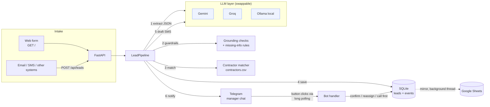
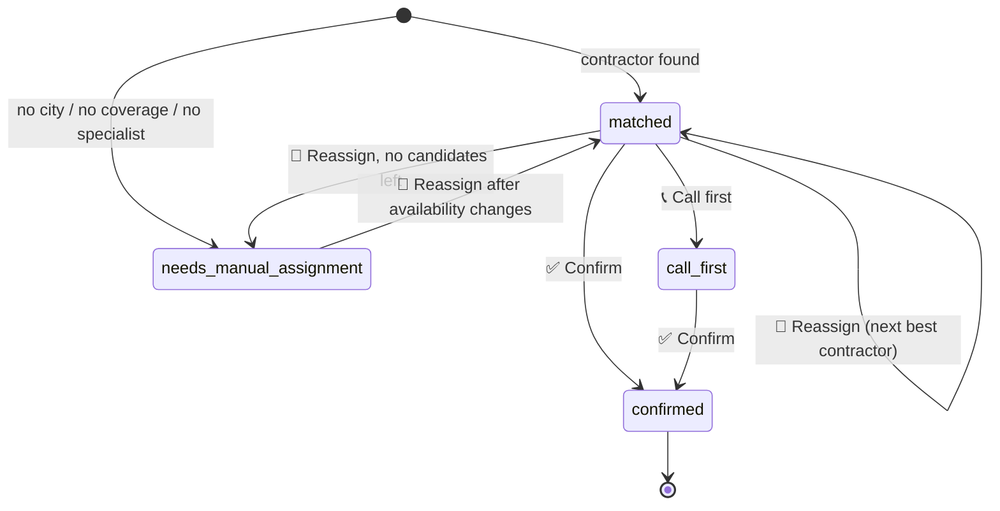
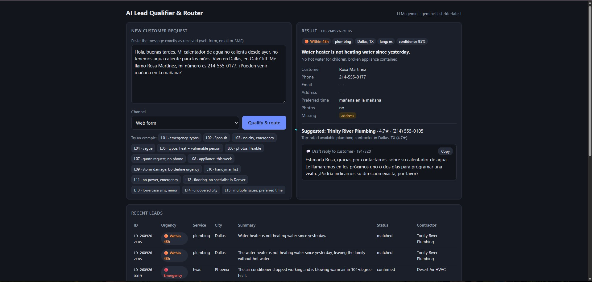
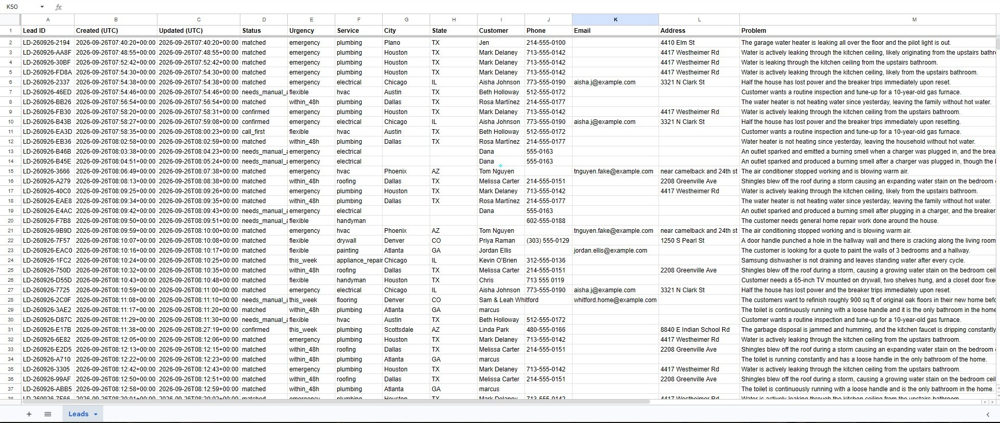

# AI Lead Qualifier & Router

**Turns a messy customer message into a qualified, routed lead in about 3 seconds, and puts it in front of a manager in Telegram with one-tap decisions.**

Built for a remote back office that dispatches home repair contractors (plumbing, electrical, HVAC, handyman, drywall, painting, appliance repair, and more) across many US cities. Runs entirely on free tiers: **$0 to run, no credit card anywhere.**

<p align="center">
  
</p>

---

## The problem

Customer requests come in as free text through a web form, email or SMS. They look like this:

> *"HELP water is comming thru the kitchen cieling right now … Mark Delaney, 4417 Westheimer Rd Houston TX, 713-555-0142. pls send someone asap!!"*

> *"Hola, mi calentador de agua no calienta desde ayer … Vivo en Dallas … mi número es 214-555-0177"*

> *"need some work done around the house. call me back. 602-555-0188"*

For each one, someone in the back office has to:
- read it and work out the trade, city and urgency
- find a contractor who covers that city, has the right specialization and is available
- log it
- tell a manager
- write back to the customer

Done by hand, that takes minutes per lead, and emergencies wait in the same queue as paint quotes. For the customer, the first company to call back usually wins the job.

## The solution

| Step | What happens | How |
|---|---|---|
| 1. Intake | A message arrives through the web form or `POST /api/leads` | FastAPI |
| 2. Qualify | The LLM extracts 15 structured fields: contacts, city, trade, urgency with a reason, missing info, language, and a confidence score | Gemini with JSON schema output, validated by Pydantic |
| 3. Guardrails | Code checks the LLM output. A phone, email or city that isn't in the message is dropped, and fields a dispatcher needs are always flagged when missing | Deterministic Python |
| 4. Route | Contractor choice: same metro area (suburbs included), then specialization, then availability, then highest rating. Otherwise the lead is flagged for manual assignment with a reason | `contractors.csv` |
| 5. Store | SQLite holds the leads and a timestamped event log. A Google Sheet mirror is optional | SQLite, gspread |
| 6. Draft reply | An SMS reply of 320 characters or less, in the customer's language, that confirms the request, states the next step, and asks for missing details | Second LLM call |
| 7. Notify | A lead card goes to the managers' Telegram chat with ✅ Confirm, 🔄 Reassign and 📞 Call first buttons | Telegram Bot API, long polling |

### What the system decides, and what the LLM decides

The LLM reads and writes. Code makes every decision that must not be wrong:

- **Contact details** must appear in the original message. The model can't invent a phone number or email, and it can't guess a city from a phone area code.
- **Contractor choice** is plain Python, so the ranking is explainable and repeatable: *"Top-rated available electrical contractor in Chicago, IL (4.5★); skipped busy: Windy City Electric."*
- **Reply content** is decided in code: the next step, what to ask for, and whether a safety tip is allowed. The model only turns those facts into a natural message. It never promises prices or arrival times, and it never names a contractor before a manager confirms one.

---

## Demo results

`python run_demo.py` sends 15 realistic, messy, fictional leads through the whole pipeline. They include typos, a Spanish message, emergencies, a lead with no city, a vague request, a city with no coverage, and a trade with no local specialist.

```
#    URGENCY        SERVICE           CITY        CONTRACTOR                  SMS  TIME
L01  🔴 emergency   plumbing          Houston     Bayou City Plumbing Co      177  2.5s
L02  🟠 within_48h  plumbing          Dallas      Trinity River Plumbing      159  2.4s
L03  🔴 emergency   electrical        -           ⚠ manual                    216  2.2s
L05  🔴 emergency   hvac              Phoenix     Desert Air HVAC             165  2.8s
L11  🔴 emergency   electrical        Chicago     Lakeshore Electrical Serv…  212  5.6s
L12  🟡 this_week   flooring          Denver      ⚠ manual                    199  3.9s
L14  🟢 flexible    hvac              Austin      ⚠ manual                    164  4.1s
L15  🟡 this_week   plumbing          Scottsdale  Valley Plumbing Solutions   132  2.7s
…
processed        15/15
urgency          🔴 emergency: 4, 🟠 within_48h: 3, 🟡 this_week: 3, 🟢 flexible: 5
auto-matched     11/15 (73%), manual assignment: 4
per lead         avg 3.4s, max 7.9s (message in -> extracted, routed, reply drafted, manager notified)
```

All 4 emergencies were caught: an active ceiling leak, a sparking outlet with a burning smell, no AC at 104°F with an 82-year-old at home, and half the house without power. All 4 manual cases were flagged with the right reason: no city ×2, no coverage in Austin, and no flooring specialist in Denver.

Draft reply to the Spanish-speaking customer:

> *Estimada Rosa, hemos recibido su solicitud sobre el calentador de agua. Nos pondremos en contacto con usted para programar una visita en el próximo día o dos. Para avanzar, ¿podría indicarnos su dirección?*

---

## Business impact

| Metric | Manual triage (estimate) | With this system (measured) |
|---|---|---|
| Message received → manager sees a qualified lead | ~15–30 min, depending on inbox load | **~3 s** (avg 3.4 s, max 7.9 s over 15 leads) |
| Manager decision | Read, look up contractors, call around | **One tap**: 11–35 s in live tests |
| Emergencies | Wait in the same queue as quotes | 🔴 at the top of the card, with a reason, from second one |
| Customer first response | Written by hand, when someone gets to it | Draft ready at notification time, in the customer's language |
| Missing info | Found later, on the call | Listed on the card, and asked for in the draft reply |
| Audit trail | None | Every decision logged with who and when, e.g. `confirmed by anna 10:41` |

The system-side times are measured from this project's event log. The manual baseline is an estimate for a small back office triaging an inbox by hand, not a measurement. In home services, speed to lead is often what wins the job, and the measurable result here is **lead to manager reaction going from ~30 min to under 1 min**.

---

## Architecture



### Lead lifecycle



### Reliability choices

- **Free-tier rate limits:**
  - 429 and 5xx errors are retried with exponential backoff and jitter, using the server's `retryDelay` when it sends one.
  - Each request is capped at 30 s.
  - A daily quota error fails fast with a clear message instead of retrying pointlessly.
  - The demo script pauses between leads.
- **Invalid LLM output:** code fences and extra text are stripped, the result is validated with Pydantic, and there is one corrective retry that includes the validation error.
- **Side effects never lose a lead:**
  - A failed Telegram send is logged as a `notify_failed` event, and the lead is kept.
  - A failed reply draft falls back to a template.
  - Google Sheets errors are logged and never reach the user.
- **Sheets writes** run on a background thread. All updates to one lead within 1.5 s become one write, and values are written as `RAW` text, so customer text can't run as a spreadsheet formula.
- **Telegram safety:**
  - Button clicks from any chat other than the manager chat are rejected.
  - The bot token never appears in logs.
  - Nothing needs a public URL, because the bot uses long polling instead of webhooks.

---

## The LLM provider is swappable

Everything above the LLM layer depends on one small interface:

```python
class LLMClient:
    async def generate_json(self, system: str, user: str, schema: dict | None = None) -> dict: ...
    async def generate_text(self, system: str, user: str) -> str: ...
```

Switching providers is one line in `.env`:

| `LLM_PROVIDER` | Default model | Notes |
|---|---|---|
| `gemini` (default) | `gemini-flash-lite-latest` | Free tier via Google AI Studio, native JSON schema output. **Tested end to end.** |
| `groq` | `llama-3.3-70b-versatile` | Free tier, OpenAI-compatible API, JSON mode |
| `ollama` | `qwen2.5:7b` | Fully local and offline, JSON schema output |

In production, the same interface takes **Claude** or **GPT** as one more ~40-line class. The prompts, guardrails, matching, storage and Telegram flow stay the same. Latency and cost would then be the only reasons to pick one model over another.

---

## Setup

Requirements: Python 3.11+ and a free Google AI Studio key. Telegram and Google Sheets are optional.

```bash
python -m venv .venv
.venv\Scripts\activate          # macOS/Linux: source .venv/bin/activate
pip install -r requirements.txt
copy .env.example .env          # macOS/Linux: cp .env.example .env
```

### 1. LLM key (required)

Get a free key at [aistudio.google.com/apikey](https://aistudio.google.com/apikey) and set `GEMINI_API_KEY` in `.env`.

> The free tier of `gemini-flash-latest` allows only ~20 requests per day, which is why the default is `gemini-flash-lite-latest`. Each lead uses 2 requests.

### 2. Telegram (optional, recommended)

1. Create a bot with [@BotFather](https://t.me/BotFather) using `/newbot`, and copy the token into `TELEGRAM_BOT_TOKEN`.
2. Create a group for your managers and add the bot to it. The bot posts the group's chat ID when it joins, or you can send `/start@your_bot` in the group.
3. Put that ID in `TELEGRAM_MANAGER_CHAT_ID`. A private chat with the bot also works.

A group suits a team better than a private chat: everyone sees new leads, and each card shows who took which decision.

### 3. Google Sheets mirror (optional)

1. In [Google Cloud Console](https://console.cloud.google.com), create a project and enable the **Google Sheets API**. No billing is needed.
2. Go to **IAM & Admin → Service Accounts**, create one, then **Keys → Add key → JSON**. Save the file into `credentials/`, which is gitignored.
3. Create a Google Sheet and **share** it, as **Editor**, with the service account's email (`…@….iam.gserviceaccount.com`).
4. Set `GOOGLE_SHEETS_CREDENTIALS_FILE=credentials/<file>.json` and `GOOGLE_SHEET_ID=<id from the sheet URL>`. The full URL works too.
5. Optional: `python scripts/sync_sheets.py` copies existing leads into the sheet.

### Run

```bash
python main.py        # web form + API + Telegram bot, one process
```

- Web form: http://127.0.0.1:8000/
- API docs: http://127.0.0.1:8000/docs
- `GET /health` shows which provider, model and integrations are active.

```bash
python run_demo.py                  # all 15 sample leads (run main.py in parallel so buttons work)
python run_demo.py --only L02 L05   # selected leads
python run_demo.py --no-telegram    # don't post to Telegram
python -m pytest                    # 46 offline tests, no API keys needed
```

**Web form**: paste a message, get the qualified lead, suggested contractor and draft reply



**Google Sheets mirror**: every lead and status change, live



---

## API

| Method | Path | Description |
|---|---|---|
| `GET` | `/` | Lead intake form |
| `POST` | `/api/leads` | `{"text": "...", "source": "web_form" \| "email" \| "sms"}` returns the lead, the match with backup contractors, and the draft reply |
| `GET` | `/api/leads?status=&limit=` | Recent leads |
| `GET` | `/api/leads/{id}` | One lead and its event history |
| `GET` | `/health` | Active LLM provider, model and integrations |

Errors: a message that can't be understood returns `422`, and an LLM outage or used-up quota returns `503` with the reason.

Telegram commands: `/pending` lists open leads, and `/start` shows the chat ID.

---

## Project structure

```
main.py                 # one command: FastAPI + Telegram polling
run_demo.py             # end-to-end demo over the sample leads
app/
  config.py             # settings from .env
  models.py             # extraction schema, lead record, statuses
  prompts.py            # extraction prompt
  extractor.py          # LLM extraction + validation + grounding guardrails
  matcher.py            # metro-aware contractor matching
  reply.py              # draft SMS: facts in code, wording by LLM
  pipeline.py           # extract -> match -> save -> reply -> notify; manager actions
  telegram_bot.py       # lead cards, buttons, long polling
  api.py                # routes
  llm/                  # base interface + gemini / groq / ollama
  storage/              # SQLite (default) + Google Sheets mirror
  templates/form.html
data/
  contractors.csv       # 20 fictional contractors in 6 cities
  sample_leads.json     # 15 fictional messy leads
scripts/                # test_extraction.py, test_matching.py, sync_sheets.py
tests/                  # 46 offline tests (fake LLM, fake worksheet, stubbed Telegram)
```

All names, phone numbers (555-01xx) and emails (`example.com`) in the sample data are fictional.

---

## Limitations and next steps

- **Inbound channels:** leads come in through the form or API. Next would be email (Gmail API) and SMS (Twilio) connectors that post to `/api/leads`, and sending the approved draft reply back automatically.
- **Contractor data** lives in a CSV that reloads when you edit it. A real deployment would read from a CRM or dispatch tool such as Jobber, ServiceTitan or Housecall Pro.
- **Button permissions:** anyone in the manager group can press the buttons. Access could be limited to specific Telegram users or admins.
- **Replies:** the fallback template, used only when the LLM is down, is English only. Showing an English translation of non-English drafts would help managers who don't read Spanish.
- **Repeat leads:** duplicates from the same phone number aren't merged yet.
- **Telegram Topics** could separate 🔴 emergencies, cities, and leads needing manual assignment into their own threads.
